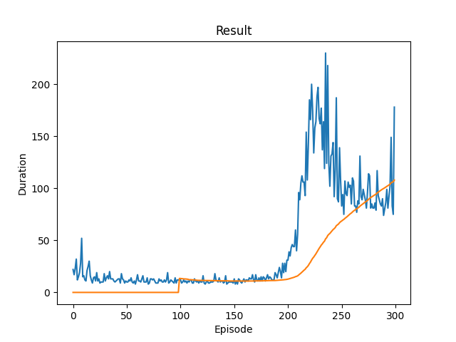
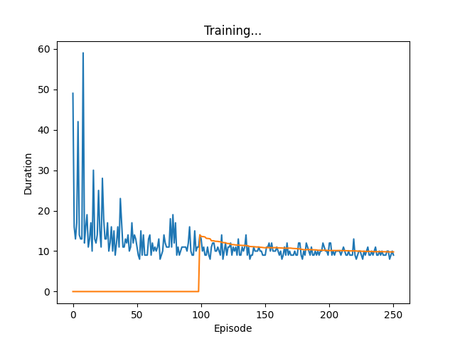
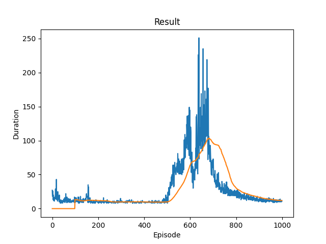
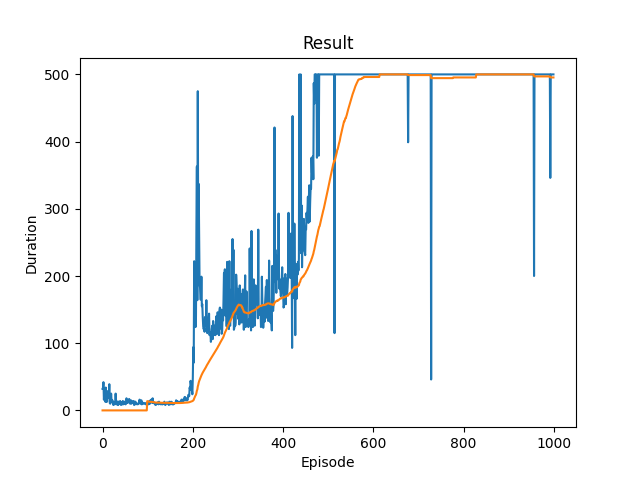
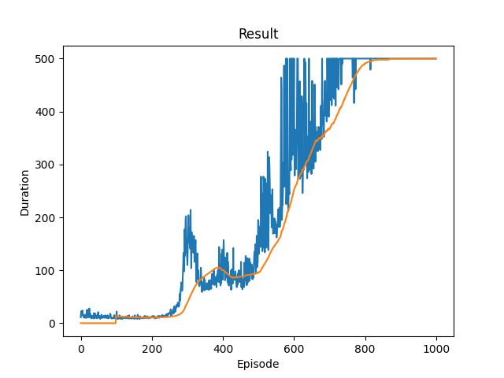
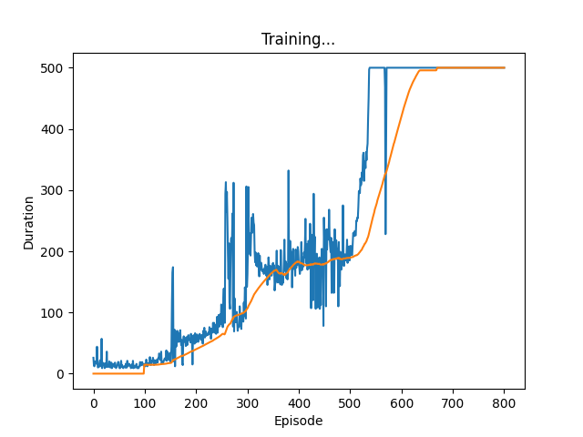
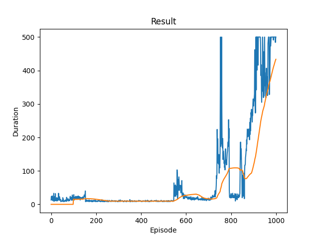

# DQNLearn

用一个policy net 与一个target net, policy net 用来学习 (s,a)的估值，target net 与policy net 关联(0.95)，用于更新policy 的参数
每次都同步，结果：

尝试改为50次之后同步

改为100次之后同步，调长到1000ep

应该在学起来后减小policy与target的差异？或者是关联打破还不够？差异大应该不会导致倒退，改为128次之后同步，结果大有提升

retry后寄了，可能是运气原因
改成256，又好了，retry也很好，说明打破关联的重要

retry:

relay-buffer,取消掉之后确实稳定性大大下降

需要枚举所有action space. 在我们的问题中不适用。
目前想法：
生成分配->用小距离算子/阶段二调整到一个local-minimum->学习

